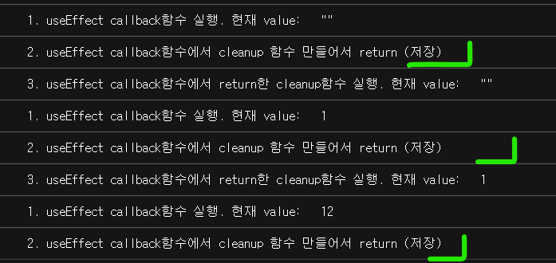

# 오늘 한 일

- 알고리즘 문자열 탐색
  - String, Set
- 리액트
  - useEffect
- 자바스크립트
  - 노마드코더 챌린지 Assignment 4

---

# 오늘의 코드

```js
import React, { useEffect } from 'react';
const App = () => {
  const [value, setValue] = React.useState('');
  useEffect(() => {
    console.log('1. useEffect callback함수 실행. 현재 value: ', value);
    console.log(
      '2. useEffect callback함수에서 cleanup 함수 만들어서 return (저장)'
    );
    function cleanup() {
      console.log(
        '3. useEffect callback함수에서 return한 cleanup함수 실행. 현재 value: ',
        value
      );
    }
    return cleanup;
  }, [value]);

  return (
    <>
      <input
        value={value}
        onChange={(e) => {
          setValue(e.target.value);
        }}
      />
    </>
  );
};

export default App;
```

console.log로 출력해보면,



1을 입력한 순간, 3. cleanup 함수가 실행되고  
dependency array 값이 바뀌었기 때문에 1. useEffect callback 함수가 실행됩니다.  
실행되면서 2. 현재 값의 cleanup 함수를 만들어 저장합니다.

App 함수 컴포넌트가 다시 실행(렌더)되더라도, 콜백함수는 첫번째 render이후에만 실행.  
최초 render 이후 1회 실행,
그 다음부턴 dependency array에 넣은 값(=value)이 바뀌면, callback함수 재실행.  
<strong>기존 value가 바뀌면</strong> 기존 value를 기준으로 cleanup 함수 실행.

---

# 내일 할 일

- 알고리즘 수업 자료 정리 day1, 과제
- React 자료 정리
