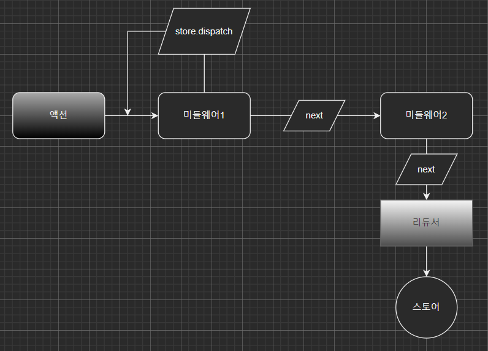

# Done

- 리액트를 다루는 기술 ~ch10  
  프로젝트 따라하는 도중에 체크 박스가 자꾸 다 체크 표시가 되어서 왜 true로 받지? 하면서 한참을 찾았는데 'false'가 범인이었다😭 'false'는 true야!!!
- React 실시간 강의
  - Redux
  - middleware, redux-thunk
    - 오늘도 리액트는 어려웠지만,,, 재미있었습니다,,,😌  
      나는요,,, 완전히 붕괴됐어요,,, 신통방통한 컴퓨터 같으니,,,
- 노마드코더 챌린지

# Today's code

```
dispatch된 액션을 50%의 확률로 버리는 middleware를
작성하고 등록해보기
```

```js
const someMiddleware = (store) => (next) => (action) => {
  if (Math.random() < 0.5) {
    next(action);
  } else {
    console.log('운이 없어서 로그인 실패,,,');
  }
};
```

`store`와 action을 파라미터로 받는 함수  
action이 dispatch되면 등록된 middleware에 순차적으로 input  
모든 미들웨어를 통과하면 reducer에 도착한다.



# To do

- 리액트: 리액트를 다루는 기술 ~ch18
- 리액트 강의 복습
- 노마드코더 챌린지
