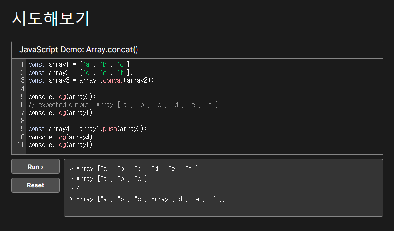

# 오늘 한 일

- To do list 코드 공유  
  새로운 조가 만들어졌다. 각자 리액트로 to do list를 만들어보기로 했고, 오늘 서로의 코드를 설명해보
  는 시간을 가졌다. 조금 더 리액트 hook들을 열심히 익혀야겠다고 다짐했다...!  
  다혜님 덕분에 메서드 공부 시간을 가졌다! `map`은 무언가를 return 할 수 있게 해줘야한다!

- JavaScript 보충 실시간 강의

  - webpack.config.js 작성, parcel, webpack으로 react 구성해보기
  - node.js API 작성

  POST PUT DELETE 부분이 조금 복잡하게 느껴져서 동작을 다시 봐야겠다.

# 오늘의 코드

concat과 push

```js
const onInsert = useCallback(
  (text) => {
    const todo = {
      id: nextId.current,
      text,
      checked: false,
    };
    setTodos(todos.concat(todo));
    nextId.current += 1;
  },
  [todos]
);
```

```
todos.push(todo)가 안되는 이유:
concat은 배열의 요소들을 풀어서 새 배열로 만들어주고 원본 배열을 유지하지만, push는 배열의 새로운 길이를 반환하고! 원본 배열을 변경한다.

실제로 push로 변경해보니 todos가 다 날아갔다.
```

  
4를 반환해서 놀랐다...

```js
const onToggle = useCallback(
  (id) => {
    setTodos(todos.map((todo) => (todo.id === id ? { ...todo, checked: !todo.checked } : todo)));
  },
  [todos]
);
```

```
[todos]의 상태가 변할 때 마다 callback 함수 실행! -> useCallback
todos의 item들(todo)의 id가 같을 때 (id가 선택됐을 때), 모든 item들을 가져오고, 선택된 id의 checked가 true이면 false, false이면 true로 변경하고 같은 id(선택된 id)가 아니면 todo를 그대로 반환한다는 의미.
```

# 내일 할 일

- redux, react-redux, middleware
- 김민태의 프론트엔드 아카데미
- CS50 1: 컴퓨터와 컴퓨팅
- `REST API`란? 블로그에 작성하기 (일요일)
